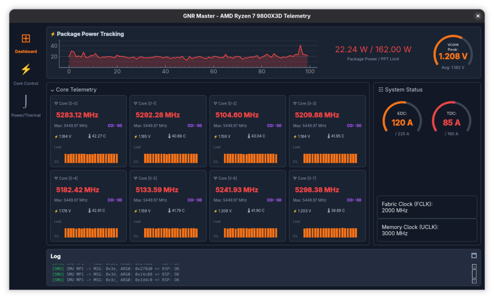

# GNR-SMU : Granite Ridge SMU Control

Tools and dynamic telemetry map for AMD Granite Ridge (Zen 5) SMU management, specifically targeting the Ryzen 7 9800X3D under Linux.

## 🚀 Key Discoveries

- **Hardware Architecture Mappings:**
  - **TDC limit:** Mapped to offset `0x3D` (not 0x3C as previously assumed on Zen 4). AMD hardware explicitly prevents runtime modifications of TDC on the 9800X3D for thermal safety.
  - **EDC limit:** Mapped to offset `0x3C`.
  - **Curve Optimizer (CO):** Write-only parameter. Local configuration caching ensures consistency across resets.
- **PM Table Mapping:** Successfully mapped the `0x724` byte telemetry table. We successfully mapped FCLK, UCLK, and MCLK, alongside the elusive **iGPU power and junction temperatures** using stochastic correlation routines.
- **Telemetry Access:** Real-time data is natively exposed by the `ryzen_smu` driver at `/sys/kernel/ryzen_smu_drv/pm_table`.

## 🛠 Tools

### 1. `gnr_master.py` (CLI Version)
A lightweight command-line interface to read from and write boundaries to the hardware registers.
- **Location:** `tools/gnr_master.py`
- **Usage:** `sudo python3 tools/gnr_master.py`

### 2. `gnr_master.py` (GUI Version)
A comprehensive PyQt6-based dashboard for real-time telemetry monitoring. Visualizes per-Core frequencies, voltages, Pkg powers, and Curve Optimizer offsets.
- **Location:** `tools/gui/gnr_master.py`
- **Usage:** `sudo python3 tools/gui/gnr_master.py`

## 📖 Research Files & Archives
- [BASELINE_SNAPSHOT.md](./BASELINE_SNAPSHOT.md): Exhaustive log of idle states, memory controllers, and structural pitfall documentation.
- [PM_TABLE_MAP.md](./PM_TABLE_MAP.md): Detailed byte-by-byte layout of the telemetry table, documenting over 50 specific floats.
- `research/`: Archived scripts used during the initial automated fuzzing, iGPU correlation hunting, and payload sniffing.

## 📋 Prerequisites
- **Linux Kernel:** 6.10+
- **Driver:** The official [ryzen_smu](https://github.com/amkillam/ryzen_smu) driver must be loaded (available in `ryzen_smu_source/`).
- **Dependencies:** `python3-pyqt6` for the GUI.

## ⚠ Safety & Disclaimer
**This is experimental software.**
- Overriding hardware boundaries via the SMU mailbox is inherently dangerous. Exceeding PPT/EDC limits randomly could fry components.
- The 3D V-Cache operates strictly beneath an 89°C / 95°C max threshold.
- The SMU defaults are highly volatile and a hard reset will revert all software commands to the Motherboard's BIOS constraints.

## ⚖️ License
You are free to use, modify, and distribute this codebase for your own projects, **provided that you attribute the original author (Zorko)** and link back to this repository.
**You may NOT use this software for commercial purposes or sell it.** (CC BY-NC 4.0)

---
*Reverse-engineered and maintained by Zorko & Antigravity - April 2026*
